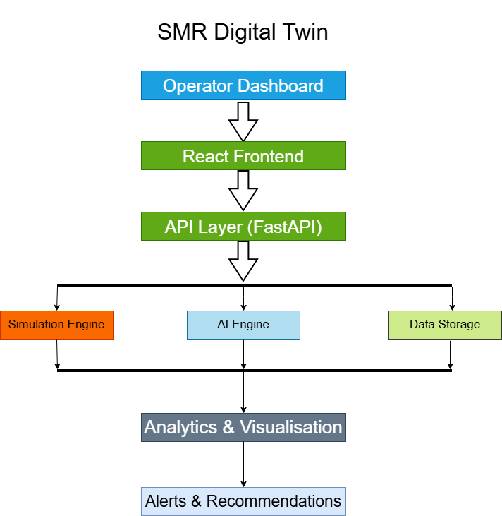

# SMR Digital Twin

> **AI-powered Digital Twin for Small Modular Reactors (SMRs) designed to simulate reactor operations, monitor system health, detect anomalies and support intelligent decision-making for mission-critical infrastructure.**

## Project Vision

The SMR Digital Twin aims to demonstrate how Artificial Intelligence, Digital Twins and modern cloud technologies can enhance the safety, reliability, efficiency and operational awareness of next-generation nuclear power systems.

This project combines real-time simulation, predictive analytics, visualization and AI-assisted decision support into a single integrated platform.

## System Architecture

## Key Features

- Real-time reactor simulation
- AI-powered anomaly detection
- Predictive maintenance analytics
- Operational dashboard
- Safety monitoring
- Interactive digital twin visualization
- Cloud-ready architecture
- Extensible AI assistant for operator support

## Technology Stack

| Category | Technologies |
|----------|--------------|
| Frontend | React, Tailwind CSS |
| Backend | Python, FastAPI |
| AI/ML | OpenAI APIs, Scikit-learn, Pandas |
| Visualization | Recharts, D3.js |
| Simulation | Physics-based Reactor Models |
| Database | PostgreSQL / SQLite |
| Deployment | Docker, Azure, AWS |

## Roadmap

### Phase 1 – Foundation
- [x] Repository created
- [x] Project vision defined
- [x] Core feature set identified

### Phase 2 – User Interface
- [ ] Interactive reactor dashboard
- [ ] Real-time parameter visualization
- [ ] Alarm and notification panel

### Phase 3 – AI Capabilities
- [ ] Predictive maintenance
- [ ] Anomaly detection
- [ ] AI-assisted operator recommendations

### Phase 4 – Deployment
- [ ] Docker deployment
- [ ] Azure hosting
- [ ] AWS deployment
